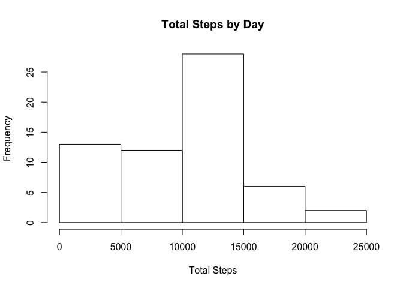
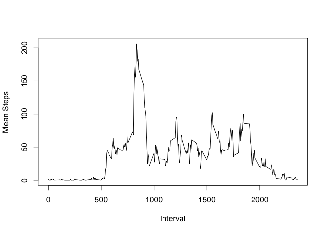
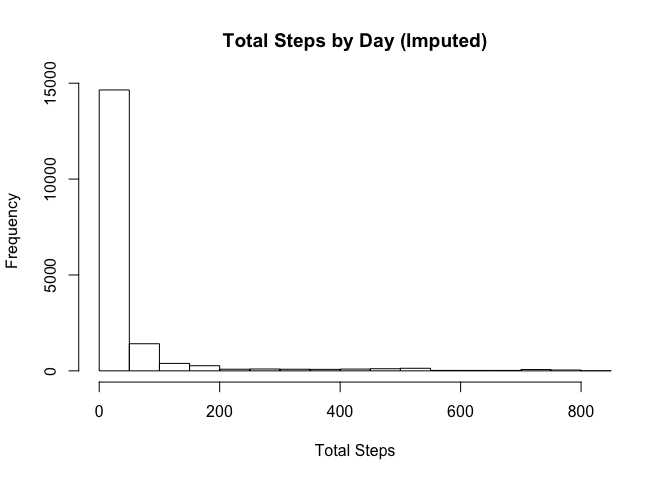
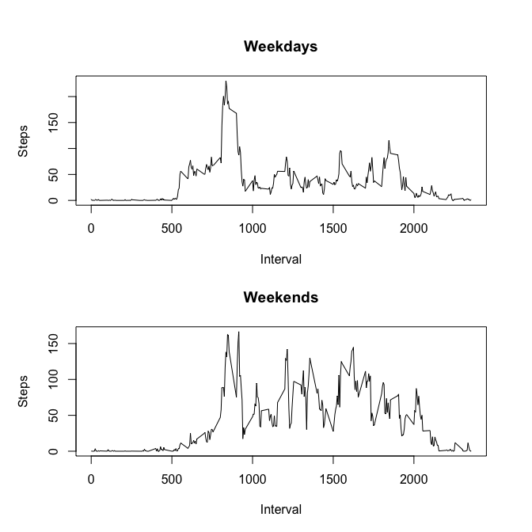

# Reproducible Research: Peer Assessment 1


## Loading and preprocessing the data
First we load the raw activity data from the `activity.zip` file.

```r
zipped_activity <- unz("activity.zip", filename = "activity.csv")
activity_data <- read.csv(zipped_activity, 
                          colClasses = c("numeric", "POSIXct", "numeric"))
```

## What is mean total number of steps taken per day?

First we summarize the number of steps observed for each day:

```r
library(dplyr, warn.conflicts = FALSE)

daily_step_totals <- group_by(activity_data, date) %>% 
    summarize(total_steps = sum(steps, na.rm = TRUE))
```

The histogram below shows the distribution of daily totals:

```r
hist(daily_step_totals$total_steps,  
     main = "Total Steps by Day", 
     xlab = "Total Steps")
```

 

The mean of this data is 9354.2295082 and the median is
1.0395\times 10^{4}.

## What is the average daily activity pattern?
First, we get the average number of steps for each interval period across
all observed days:

```r
interval_step_averages <- 
    group_by(activity_data, interval) %>% 
    summarize(mean_steps = mean(steps, na.rm = TRUE))
```

The following graph shows the average number of steps taken in each interval
across all days in the activity data set:

```r
plot(interval_step_averages$interval, 
     interval_step_averages$mean_steps, 
     type="l",
     xlab = "Interval", 
     ylab = "Mean Steps")
```

 


```r
highest_interval <- filter(interval_step_averages, mean_steps == max(mean_steps))
```
The interval with the highest mean number of steps is 835.

## Imputing missing values

```r
num_missing <- nrow(filter(activity_data, is.na(steps)))
```
The data-set is missing several values for certain intervals. A total of
2304 observations have no recorded steps activity.

For each observation with a missing `steps` value, we replace it with the
_mean_ of observed steps for the same interval.
like this:

```r
interval_means <- activity_data %>% 
    group_by(interval) %>% 
    summarize(mean_steps = mean(steps, na.rm = TRUE))

filled_activity_data <- 
    transform(activity_data, 
              steps = ifelse(is.na(steps), 
                             interval_means[interval_means$interval == interval]$mean_steps, 
                             steps))
```

We can look at the distribution of the imputed values with this histogram:

```r
hist(filled_activity_data$steps,  
     main = "Total Steps by Day (Imputed)", 
     xlab = "Total Steps")
```

 

The _mean_ number of steps is 37.3825996 and the
_median_ number of steps is 0. When we 
fill in the missing observations the distribution of values skews much 
closer to zero. This is due to the prevlance of observations with 0 as the
observed value for the `steps` variable.

## Are there differences in activity patterns between weekdays and weekends?
To determine the differences in activity based the day of the week, we first
calculate a new factor variable in the `filled_activty_data` called
`day_type` which is a factor with two possible values: "weekday" and "weekend".


```r
weekdays <- c("Monday", "Tuesday", "Wednesday", "Thursday", "Friday")
filled_activity_data <- 
    transform(filled_activity_data,
              day_type = as.factor(ifelse(weekdays(date) %in% weekdays,
                                          "weekday",
                                          "weekend")))

weekday_activity <- 
    filter(filled_activity_data, day_type == "weekday") %>%
    group_by(interval) %>%
    summarize(mean_steps = mean(steps))

weekend_activity <- 
    filter(filled_activity_data, day_type == "weekend") %>%
    group_by(interval) %>%
    summarize(mean_steps = mean(steps))
```

Now we'll compare these two sets with a pair of simple line-plots:

```r
par(mfrow = c(2, 1), mar = c(4, 4, 4, 2), oma = c(1, 1, 1, 1))
with(weekday_activity, 
     plot(interval, mean_steps, type="l", cex=0.5,
          main="Weekdays", xlab="Interval", ylab="Steps"))

with(weekend_activity, 
     plot(interval, mean_steps, type="l", cex=0.5, 
          main="Weekends", xlab="Interval",  ylab="Steps"))    
```

 
